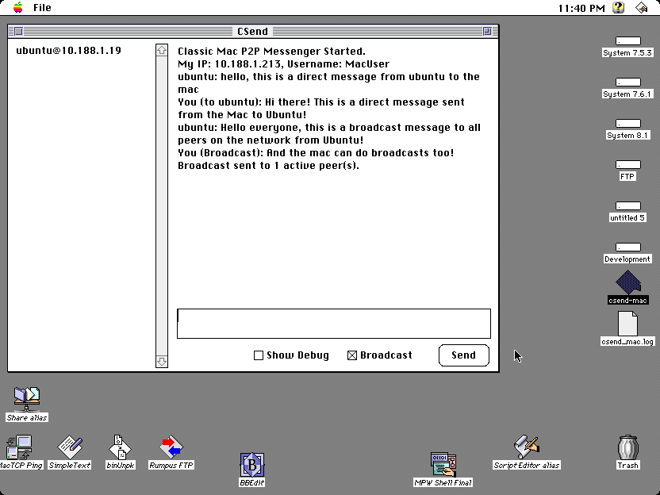
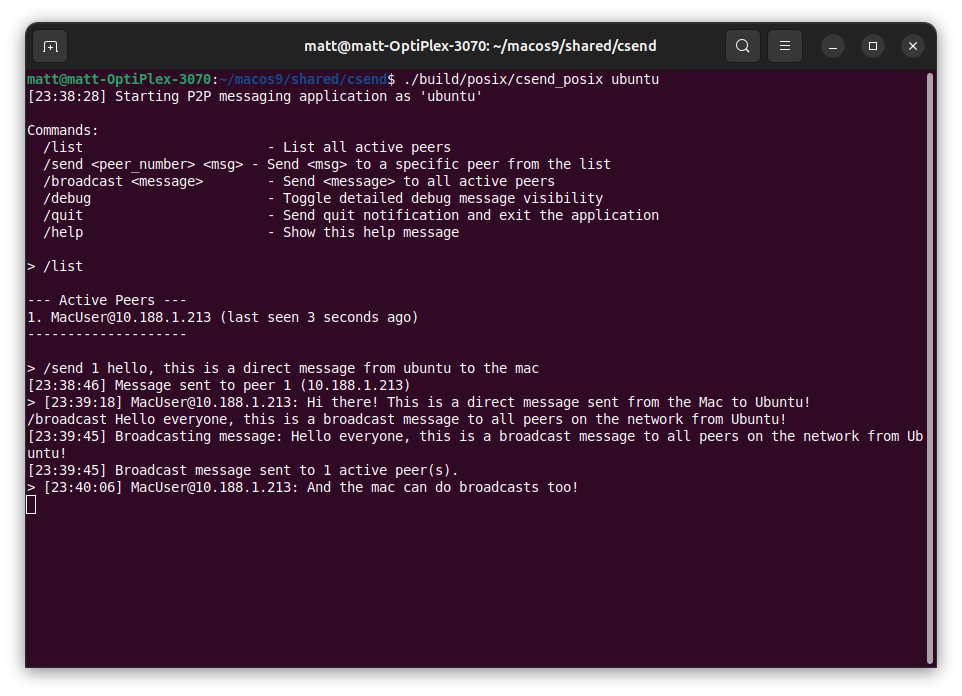

# CSend - Cross-Platform P2P Chat

<p align="center">
  
  
</p>

Peer-to-peer text chat between Classic Macs and modern systems over a LAN. Built on the [PeerTalk SDK](https://github.com/matthewdeaves/peertalk) for all networking.

## Builds

| Target | Platform | Network | Output |
|--------|----------|---------|--------|
| csend-posix | Linux / macOS | POSIX sockets | `build/csend-posix` |
| csend-mac (68k) | System 7+ | MacTCP | `build-68k/csend-mac.bin` |
| csend-mac (68k) | System 7.5+ | Open Transport | `build-68k-ot/csend-mac.bin` |
| csend-mac (PPC) | System 7+ | MacTCP | `build-ppc-mactcp/csend-mac.bin` |
| csend-mac (PPC) | System 7.5+ | Open Transport | `build-ppc-ot/csend-mac.bin` |

## Prerequisites

The full dependency chain for building csend:

- **[Retro68](https://github.com/matthewdeaves/Retro68)** — Classic Mac cross-compiler (fork with OT fixes). Only needed for Classic Mac targets.
- **[clog](https://github.com/matthewdeaves/clog)** — Minimal C89 logging library. Must be built with matching Retro68 toolchain for Classic Mac targets.
- **[PeerTalk SDK](https://github.com/matthewdeaves/peertalk)** — Networking SDK for discovery, connections, and messaging across POSIX/MacTCP/OpenTransport.

### Dependency Chain

```
Retro68 -> clog -> peertalk -> csend
```

### Environment Variables

| Variable | Default | Description |
|----------|---------|-------------|
| `$CLOG_DIR` | `~/clog` | Path to the clog source directory |
| `$PEERTALK_DIR` | `~/peertalk` | Path to the PeerTalk SDK source directory |
| `$RETRO68_TOOLCHAIN` | `~/Retro68-build/toolchain` | Path to the Retro68 toolchain install |

## Setup

Run `./setup.sh` to bootstrap everything from scratch. It will clone and build all dependencies (Retro68, clog, peertalk) and configure the environment so you can build all csend targets.

## Building

Requires [PeerTalk SDK](https://github.com/matthewdeaves/peertalk), [clog](https://github.com/matthewdeaves/clog), and [Retro68](https://github.com/matthewdeaves/Retro68) (fork with OT fixes) for Classic Mac targets.

```bash
# POSIX
cmake -B build -DCLOG_DIR=$CLOG_DIR && cmake --build build

# 68k MacTCP
cmake -B build-68k \
  -DCMAKE_TOOLCHAIN_FILE=$RETRO68_TOOLCHAIN/m68k-apple-macos/cmake/retro68.toolchain.cmake \
  -DPT_PLATFORM=MACTCP -DCLOG_DIR=$CLOG_DIR -DCLOG_LIB_DIR=$CLOG_DIR/build-68k
cmake --build build-68k

# PPC Open Transport
cmake -B build-ppc-ot \
  -DCMAKE_TOOLCHAIN_FILE=$RETRO68_TOOLCHAIN/powerpc-apple-macos/cmake/retroppc.toolchain.cmake \
  -DPT_PLATFORM=OT -DCLOG_DIR=$CLOG_DIR -DCLOG_LIB_DIR=$CLOG_DIR/build-ppc
cmake --build build-ppc-ot
```

## Usage

### POSIX
```bash
./build/csend-posix <username>

# Commands
/list                      # Show connected peers
/send <peer_num> <message> # Send to specific peer
/broadcast <message>       # Send to all peers
/debug                     # Toggle debug output
/test                      # Run automated test sequence
/quit                      # Exit
```

### Classic Mac

Deploy `.bin` to real hardware via FTP or disk image. The GUI provides a message area, input field, peer list, send button, broadcast checkbox, and debug toggle.

## Architecture

csend is a thin UI layer on top of PeerTalk. The SDK handles discovery, connections, and messaging. csend provides the interface.

```
posix/              POSIX terminal UI (2-thread: main PT_Poll + stdin input)
classic_mac/        Classic Mac Toolbox UI (single-threaded event loop)
shared/             Common definitions, Classic Mac UI components
MPW_resources/      ResEdit binary resources (.finf/.rsrc metadata)
```

- **POSIX**: C11, pthreads for stdin only, SPSC ring buffer for command queue
- **Classic Mac**: C89, `WaitNextEvent` + `PT_Poll` in idle handler
- **Shared**: `MSG_CHAT` message type, `BUFFER_SIZE` constant

## Demo

- [Latest demo](https://m.youtube.com/watch?v=YHCS2WfRO2Y)
- [Original demo](https://www.youtube.com/watch?v=_9iXCBZ_FjE)
