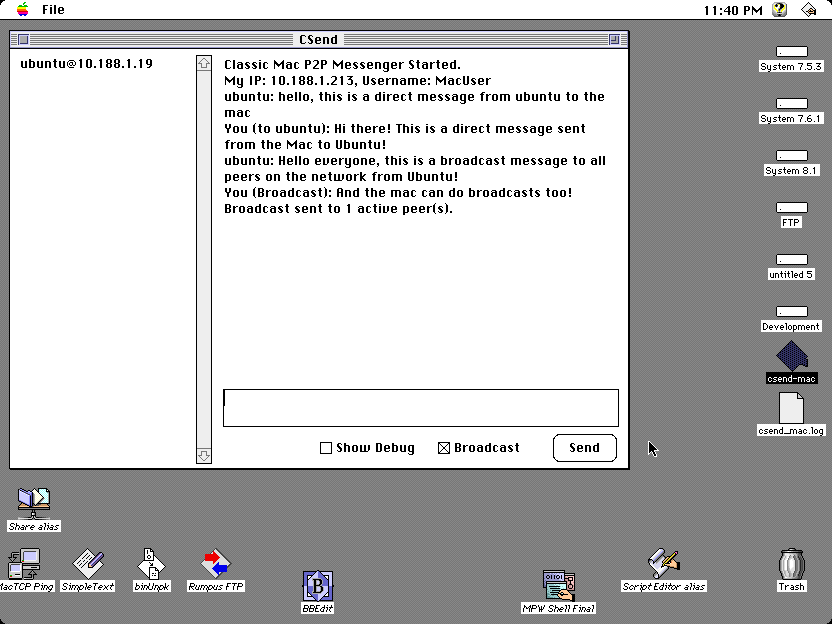
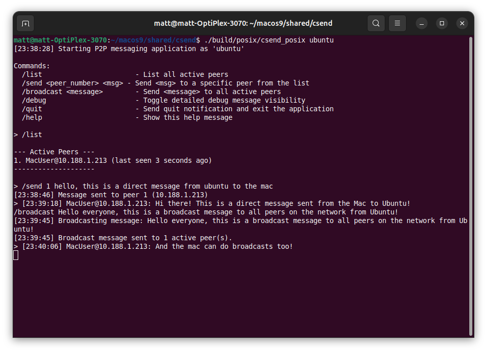

# 🌐 CSend - Cross-Platform P2P Terminal Chat

<p align="center">
  
  
</p>

**CSend** is a cross-platform peer-to-peer chat application written in C, supporting both modern POSIX systems and Classic Macintosh (System 7.x). It demonstrates network programming across different eras of computing, from modern multi-threaded applications to single-threaded GUI applications.

## 🎥 Demo Videos

- [Latest Demo](https://m.youtube.com/watch?v=YHCS2WfRO2Y) - Current functionality showcase
- [Original Demo](https://www.youtube.com/watch?v=_9iXCBZ_FjE) - Early version (functionality has evolved significantly)

## ✨ Key Features

### 🖥️ **POSIX Version** (Linux, macOS)
- **Multi-threaded Architecture**: Separate threads for input, networking, and discovery
- **Terminal Interface**: Command-line chat with intuitive commands
- **Machine Mode**: JSON-based API for programmatic interaction
- **Claude AI Integration**: Built-in chatbot using Anthropic's Claude Haiku
- **Docker Support**: Easy multi-peer testing with containerized instances
- **Real-time Discovery**: Automatic peer detection on local networks

### 🖱️ **Classic Mac Version** (System 7.x)
- **Native GUI**: True Classic Mac interface using Dialog Manager
- **MacTCP Networking**: Dual TCP streams for robust messaging
- **Retro68 Compatible**: Builds with modern cross-compiler
- **Network Abstraction**: Ready for future OpenTransport support
- **Event-driven Architecture**: Single-threaded with asynchronous operations

### 🔧 **Shared Core**
- **Unified Protocol**: Custom message format for cross-platform compatibility
- **UDP Discovery**: Broadcast-based peer discovery
- **TCP Messaging**: Reliable direct communication between peers
- **Peer Management**: Automatic timeout handling and status tracking

## 🏗️ Architecture

The project uses a **shared core design** with platform-specific implementations:

```
csend/
├── shared/          # Platform-independent core logic
│   ├── protocol.c   # Message format and parsing
│   ├── peer.c       # Peer list management
│   ├── discovery.c  # UDP peer discovery logic
│   ├── messaging.c  # TCP message handling
│   └── logging.c    # Centralized logging system
├── posix/           # POSIX implementation
│   ├── main.c       # Multi-threaded event loop
│   ├── ui_terminal.c # Terminal interface
│   ├── commands.c   # Command processing
│   └── network.c    # POSIX networking
└── classic_mac/     # Classic Mac implementation
    ├── main.c       # Event-driven GUI loop
    ├── dialog.c     # Dialog Manager interface
    ├── mactcp_impl.c # MacTCP networking
    └── network_abstraction.c # Network layer abstraction
```

### Protocol Design
Messages use the format: `MSG_MAGIC_NUMBER|TYPE|SENDER@IP|CONTENT`

**Message Types:**
- `MSG_DISCOVERY` - Peer discovery broadcasts
- `MSG_DISCOVERY_RESPONSE` - Discovery replies
- `MSG_TEXT` - Chat messages
- `MSG_QUIT` - Graceful disconnect notifications

## 🚀 Quick Start

### POSIX Version

#### Build and Run
```bash
git clone https://github.com/matthewdeaves/csend.git
cd csend
make
./build/posix/csend_posix alice
```

#### Docker Testing (Recommended)
```bash
# Start multiple peer containers
./docker.sh start

# Check container status
./docker.sh status

# Stop all containers
./docker.sh stop
```

#### Machine Mode with AI Chatbot
```bash
# Set up Anthropic API key
export ANTHROPIC_API_KEY="your-api-key-here"

# Run Claude chatbot
./run_machine_mode.sh --chatbot
```

### Classic Mac Version

#### Prerequisites
- Retro68 cross-compiler ([setup guide](https://github.com/autc04/Retro68))
- Classic Mac OS environment ([QemuMac](https://github.com/matthewdeaves/QemuMac) recommended)

#### Build
```bash
# Quick setup for Retro68
./setup_retro68.sh

# Build Classic Mac version
make -f Makefile.retro68
```

**Output files:**
- `build/classic_mac/csend-mac.APPL` - Application bundle
- `build/classic_mac/csend-mac.bin` - MacBinary format (most portable)
- `build/classic_mac/csend-mac.dsk` - Floppy disk image

#### Run on Classic Mac
1. Transfer `csend-mac.bin` to your Classic Mac environment
2. Use **binUnpk** or **Stuffit Expander** to decode the MacBinary file
3. Double-click the extracted application to run

## 🎮 Usage

### POSIX Terminal Commands
```bash
/list                      # Show active peers
/send <peer_num> <message> # Send private message
/broadcast <message>       # Send to all peers
/debug                     # Toggle debug output
/quit                      # Exit gracefully
/help                      # Show command help
```

### Classic Mac GUI
- **Message Input**: Type in the bottom text field
- **Send Button**: Send message to selected peer or broadcast
- **Peer List**: Click to select message recipient
- **Broadcast Checkbox**: Send to all peers when checked
- **Debug Checkbox**: Show debug messages
- **Close Box**: Quit application (sends quit notifications)

### Machine Mode API
```bash
# Start machine mode
./build/posix/csend_posix --machine-mode claude

# JSON command examples
/list --id=1
/send 1 "Hello!" --id=2
/status --id=3
```

See [Machine Mode Documentation](MACHINE_MODE.md) for full API reference.

## 🛠️ Development

### Code Quality Tools

**Format code** (required before commits):
```bash
./format_code.sh
```

**Check for duplicated code**:
```bash
./cpd_check.sh
```

**Analyze complexity**:
```bash
./complexity_check.sh warnings    # Show only complex functions
./complexity_check.sh detailed    # Generate HTML reports
```

**Detect dead code**:
```bash
./deadcode_check.sh warnings      # Show compiler warnings
./deadcode_check.sh               # Full analysis
```

**Filter logs**:
```bash
./filter_logs.sh csend_posix.log NETWORK DISCOVERY
```

### Build Verification
```bash
# POSIX build
make clean && make

# Classic Mac build (requires Retro68)
make -f Makefile.retro68

# Docker multi-peer test
./docker.sh start
```

### Testing
- **Unit Testing**: No formal framework (contributions welcome)
- **Integration Testing**: Use Docker setup for multi-peer scenarios
- **Machine Mode Testing**: `test_machine_mode.py` for automated testing
- **Logging**: Enable debug mode and check log files

### Code Style
- **K&R style** with 4-space indentation
- **Complexity limits**: CCN ≤ 10, function length ≤ 60 lines
- **Thread safety**: POSIX peer list protected by mutex
- **Error handling**: Comprehensive logging with categories

## 📚 Documentation

| File | Description |
|------|-------------|
| [CLAUDE.md](CLAUDE.md) | Development guidelines for AI assistants |
| [MACHINE_MODE.md](MACHINE_MODE.md) | Complete machine mode API reference |
| [LOGGING.md](LOGGING.md) | Logging system documentation |
| [TAGS.md](TAGS.md) | Development milestone history |
| [resedit.md](resedit.md) | ResEdit and resource conversion guide |

## 🔧 Project Structure

```
csend/
├── posix/              # POSIX-specific source code
├── classic_mac/        # Classic Mac source code
├── shared/             # Platform-independent core logic
├── MPW_resources/      # Classic Mac GUI resources
├── tools/              # Development and analysis tools
├── images/             # Screenshot assets
├── build/              # Compiled binaries (generated)
├── Makefile           # POSIX build configuration
├── Makefile.retro68   # Classic Mac build configuration
├── Dockerfile         # Docker container setup
└── docker-compose.yml # Multi-container orchestration
```

## 🌟 Advanced Features

### Machine Mode & AI Integration
- **JSON API**: Structured programmatic interface
- **Claude Chatbot**: AI-powered chat participant
- **Correlation IDs**: Request/response tracking
- **Event Streaming**: Real-time peer and message events
- **Python Client**: Async client library for automation

### Network Architecture
- **UDP Discovery**: Broadcast-based peer discovery on port 2556
- **TCP Messaging**: Direct peer communication on port 2555
- **Dual Streams (Mac)**: Separate listen/send TCP connections
- **Message Queuing**: Buffered broadcasts during busy periods
- **Timeout Handling**: Automatic peer pruning (30-second timeout)

### Cross-Platform Compatibility
- **Endian Handling**: Network byte order for message magic numbers
- **Time Abstraction**: `time()` (POSIX) vs `TickCount()` (Mac)
- **Threading Models**: Multi-threaded (POSIX) vs event-driven (Mac)
- **UI Abstraction**: Terminal vs GUI with consistent command processing

## 🤝 Contributing

1. **Format your code**: Run `./format_code.sh` before committing
2. **Check complexity**: Keep functions under complexity thresholds
3. **Test thoroughly**: Use Docker setup for multi-peer testing
4. **Document changes**: Update relevant documentation files
5. **Follow patterns**: Study existing platform implementations

## 📋 Prerequisites

### For POSIX Development
- C compiler (GCC recommended)
- Make build tool
- Pthreads support
- Standard POSIX socket libraries

### For Classic Mac Development
- [Retro68](https://github.com/autc04/Retro68) cross-compiler
- Classic Mac OS environment for testing
- ResEdit for GUI resource editing (optional)

### For Docker Testing
- Docker Engine
- Docker Compose
- Compatible terminal emulator

### For AI Integration
- Python 3.6+
- Anthropic API key
- Virtual environment (automatically managed by launcher)

## 📄 License

This project demonstrates cross-platform network programming techniques and is available for educational and research purposes.

---

<p align="center">
  <strong>A bridge between computing eras - from Classic Mac to modern POSIX systems</strong>
</p>